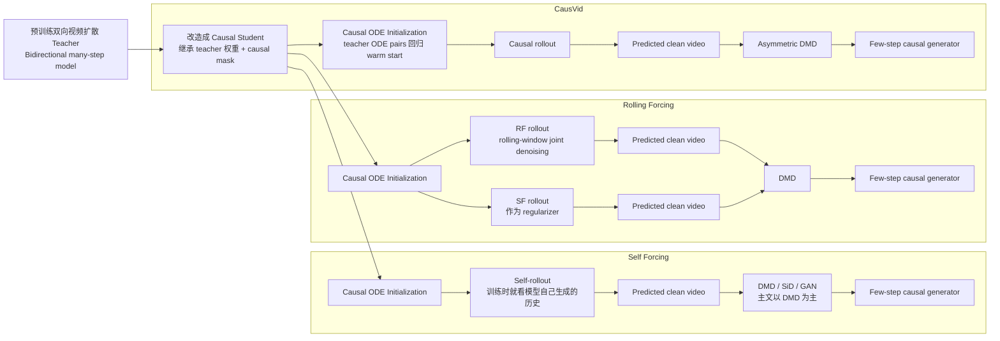

# 自回归视频扩散中的DMD、ODE初始化与Rollout轨迹

## 1. 先把最容易混淆的几个概念分开

在 `CausVid`、`Self Forcing`、`Rolling Forcing` 这条线里，至少有四种“轨迹”需要严格区分。

### 1.1 参数优化轨迹
这是训练时参数如何变化：

$$
\theta^{(0)} \to \theta^{(1)} \to \theta^{(2)} \to \cdots
$$

这叫 optimizer trajectory / parameter trajectory。通常不是这些论文里说的“trajectory”。

### 1.2 Teacher 的 ODE / Sample 轨迹
这是 teacher 对同一个噪声样本执行反向扩散或 ODE solver 时得到的解路径：

$$
x_T \to x_{t_K} \to x_{t_{K-1}} \to \cdots \to x_{t_1} \to x_0
$$

这里的每个点都是同一样本在不同噪声层的状态。`CausVid` 里说用 teacher 的 `ODE trajectories` 初始化 student，主要指这个，而不是 teacher 参数怎么训练出来。

### 1.3 Student 的 rollout 轨迹
这是自回归 student 在时间维上如何把视频往后滚出来：

$$
\hat x^1 \to \hat x^{1:2} \to \hat x^{1:3} \to \cdots \to \hat x^{1:N}
$$

这条轨迹决定了：
- student 训练时到底看到什么历史；
- DMD 最终是在什么样的 student 生成分布上做分布匹配。

### 1.4 生成分布靠近目标分布的训练轨迹
更抽象的一层，是 student 的生成分布如何在训练过程中逐渐靠近 teacher / data 分布。`DMD` 主要作用在这一层。

## 2. 整条路线的共同骨架

这几篇方法虽然细节不同，但大体都在同一个两阶段框架里：

$$
\text{pretrained bidirectional teacher}
\to
\text{causal student initialization}
\to
\text{distillation / post-training}
\to
\text{few-step causal generator}
$$

其中：
- 前半段解决“student 一开始别太差”；
- 后半段解决“student 最终真的变成高质量、few-step、可 rollout 的自回归视频扩散模型”。

## 3. 什么是 causal ODE initialization

### 3.1 本质
`causal ODE initialization` 的本质是：

1. 先把一个预训练好的双向视频扩散模型改成 causal student；
2. 再用 teacher 采样出来的一小批 `ODE solution pairs` 对 student 做 supervised warm start。

它不是最终训练目标，而是一个初始化步骤。

### 3.2 具体怎么做

先设 teacher 为一个预训练好的双向视频扩散模型，student 为加上 causal attention mask 后的自回归模型。通常 student 会继承 teacher 的绝大多数权重：

$$
\phi_0 \leftarrow \theta_{\text{teacher}}
$$

但由于 attention mask 已变，哪怕参数相同，student 的函数形式也已经变了，直接用 DMD 开训容易不稳定。

于是 teacher 用 ODE solver 生成样本轨迹：

$$
x_T \to x_{t_K} \to x_{t_{K-1}} \to \cdots \to x_{t_1} \to x_0
$$

然后从中挑出 few-step student 实际要用的噪声层。例如 student 想做 `4-step` 生成，就从 many-step teacher 轨迹中抽取：

$$
\tau_4 > \tau_3 > \tau_2 > \tau_1 > \tau_0
$$

形成若干 `ODE solution pairs`：

$$
(x_{\tau_4}, x_{\tau_3}),\quad
(x_{\tau_3}, x_{\tau_2}),\quad
(x_{\tau_2}, x_{\tau_1}),\quad
(x_{\tau_1}, x_{\tau_0})
$$

再用简单回归损失训练 student：

$$
\mathcal L_{\text{ODE-init}}
=
\sum_j
\left\|
G_\phi(x_{\tau_j}, c_{\text{past}})
-
x_{\tau_{j-1}}^{\text{teacher}}
\right\|_2^2
$$

这里：
- \(G_\phi\) 是 student；
- \(x_{\tau_j}\) 是 teacher 轨迹上的较噪状态；
- \(x_{\tau_{j-1}}^{\text{teacher}}\) 是更干净一步的 teacher 状态；
- \(c_{\text{past}}\) 是允许 student 看到的历史上下文。

### 3.3 它为什么有用

它主要解决两个问题：

#### 3.3.1 结构迁移问题
teacher 是双向 attention，student 是 causal attention。直接切结构会破坏原函数行为。ODE init 先让 student 在新结构下学会一个合理的 few-step denoising map。

#### 3.3.2 DMD 的稳定性问题
`DMD` 是分布级监督，信号更间接；而 ODE init 是样本级强监督，梯度低方差、稳定。它相当于先把 student 拉到“会去噪”的区域，再去做更难的蒸馏。

所以最短理解是：

$$
\text{teacher ODE pairs}
\Rightarrow
\text{causal student warm start}
$$

## 4. DMD 到底是什么，它要什么

### 4.1 DMD 的角色
在这条路线里，`DMD`（Distribution Matching Distillation）主要是后训练 / 蒸馏阶段的核心目标，而不是大规模预训练时的主目标。

它解决的是：

$$
\text{slow many-step teacher}
\Rightarrow
\text{fast few-step student}
$$

### 4.2 DMD 的核心对象不是“单帧标签”，而是生成分布

粗略写法下，DMD 优化的是近似 reverse KL，其梯度可以表示成两个 score 的差：

$$
\nabla_\phi \mathcal L_{\mathrm{DMD}}
\approx
-\mathbb E\left[
\left(s_{\mathrm{target}} - s_{\mathrm{gen}}\right)
\frac{\partial G_\phi}{\partial \phi}
\right]
$$

所以 DMD 真正要的不是某个逐帧真值标签，而是：
- student 当前生成出来的样本；
- 这个样本在某个噪声层上的版本；
- target score 与 generator score 的差异。

最关键的一点是：

$$
\text{DMD 优化的是 student 的生成分布，而不是逐步复刻 teacher 的每个采样步骤。}
$$

## 5. 什么叫“喂给 DMD 的 student rollout 轨迹”

这句话的意思是：

1. 先让 student 按某种规则把整段视频生成出来；
2. 得到一段 predicted clean video；
3. 再把这段视频拿去算 DMD。

也就是说，DMD 不是先验地规定“teacher 第 7 步怎么走，student 也必须第 7 步跟着走”，而是看：

$$
\hat x^{1:N} = G_\phi(z; \text{rollout policy})
$$

这里的 `rollout policy` 决定了：
- student 生成时看什么历史；
- 一次生成一帧还是一个窗口；
- 训练时的 predicted clean video 究竟来自哪种推理范式。

所以“喂给 DMD 的 student rollout 轨迹”不是 loss 本身，而是：

$$
\text{student 用什么推理规则把样本滚出来，再拿这些样本去算 DMD}
$$

## 6. CausVid、Self Forcing、Rolling Forcing 的区别

## 6.1 CausVid

### 初始化阶段
- 双向 teacher 改成 causal student
- 做 `ODE initialization`

### 后训练阶段
- student 按 chunk-wise / frame-wise causal 方式 rollout
- 用这些 student 生成结果构造 predicted clean video
- 再做 asymmetric DMD

它的核心任务是：

$$
\text{先把 bidirectional video diffusion 成功改造成 few-step causal generator}
$$

## 6.2 Self Forcing

### 初始化阶段
- 基本沿用 `CausVid` 式 ODE initialization

### 后训练阶段
- 训练时也让 student 用自己生成的历史作为上下文
- 也就是做真实 self-rollout
- 在这种 rollout 生成的视频上做 DMD

它修的核心问题是：

$$
\text{训练分布} \neq \text{推理分布}
$$

也就是 exposure bias / train-test gap。

## 6.3 Rolling Forcing

### 初始化阶段
- 同样先做 causal ODE initialization

### 后训练阶段
- 不再按 strict causal 单帧方式 rollout
- 而是按 rolling-window joint denoising rollout
- 用这样得到的 predicted clean video 去算 DMD

但它训练时不是只用 RF objective，而是：
- 一半概率用 `Self Forcing rollout + DMD`
- 一半概率用 `Rolling Forcing rollout + DMD`

所以更精确地写：

$$
\text{initialized student}
\to
\begin{cases}
\text{SF rollout} + \mathcal L_{\mathrm{DMD}} \\
\text{RF rollout} + \mathcal L_{\mathrm{DMD}}
\end{cases}
$$

其中：
- `RF rollout` 负责贴近最终推理范式；
- `SF rollout` 作为 regularizer，帮助保持更自然的运动与镜头行为。

## 7. 为什么说 Rolling Forcing 是“初始化之后，再按自己的规则 rollout，再做 DMD”

这句话基本是对的，只要再加一个限定：

$$
\text{ODE init}
\to
\text{RF/SF rollout}
\to
\text{predicted clean video}
\to
\text{DMD update}
$$

所以它不是：
- 完全从零训练一个新的模型；
- 也不是仅靠 ODE pairs 就学会长视频 rollout；

而是：
- ODE init 先给 causal student 一个稳定起点；
- RF post-training 再用 rolling-window 范式真正训练它的自回归生成行为。

## 8. 一张对照图

## 9. 一页速记

### 9.1 不要混淆的三种轨迹

$$
\text{teacher ODE trajectory}: x_T \to \cdots \to x_0
$$

$$
\text{student rollout trajectory}: \hat x^1 \to \hat x^{1:2} \to \cdots \to \hat x^{1:N}
$$

$$
\text{parameter trajectory}: \theta^{(0)} \to \theta^{(1)} \to \cdots
$$

### 9.2 ODE initialization 干什么

$$
\text{teacher ODE pairs}
\Rightarrow
\text{causal student warm start}
$$

### 9.3 DMD 干什么

$$
\text{student rollout sample}
\Rightarrow
\text{distribution matching to teacher / data}
$$

### 9.4 三篇论文的递进

$$
\text{CausVid}: \text{先把流式 few-step AR video diffusion 建起来}
$$

$$
\text{Self Forcing}: \text{再修 train-test gap}
$$

$$
\text{Rolling Forcing}: \text{再修逐帧 rollout 本身太脆弱}
$$

## 相关笔记
- [[RoPE、KV Cache与视频流式生成中的位置编码]]
- [[CausVid✅]]
- [[Self-Forcing ✅]]
- [[Rolling-Forcing✅]]
