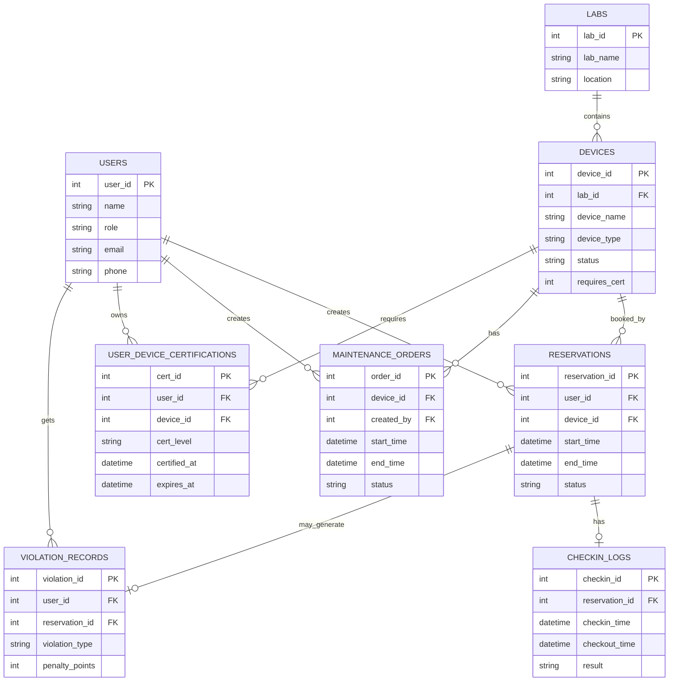

# 02. E-R 图与关系映射

## E-R 图（Mermaid）

## 从 E-R 到关系模式

- 实体转表：`USERS/LABS/DEVICES/...`
- `1:N`：在 N 端放外键（例如 `devices.lab_id`）
- `N:M`：拆桥接表（`user_device_certifications`）

## 你讲解这页时的重点

1. 核心业务主线：用户-设备-预约
2. 规则增强模块：资质、维护、签到、违约
3. 通过外键把业务关系变成数据库强约束
