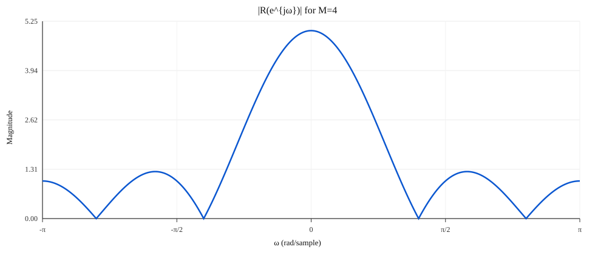
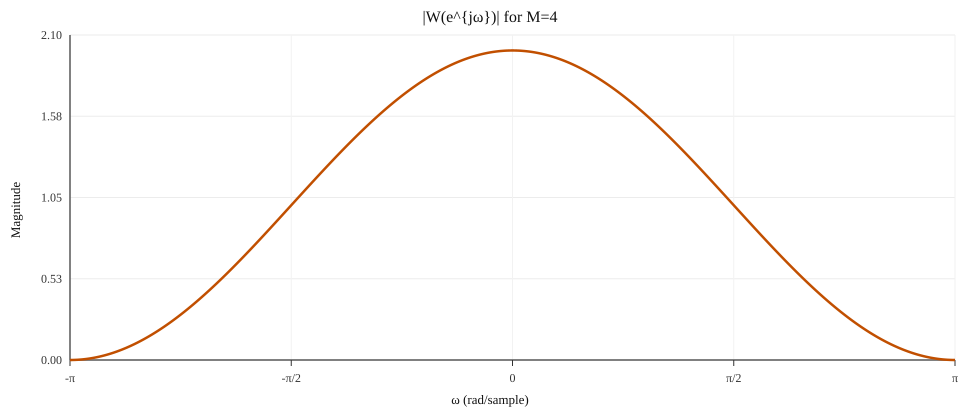

## 1

给定

$$x[n]=\cos\frac{5\pi n}{7}+\cos\frac{\pi n}{5}.$$

离散正弦的周期满足 \(\omega N=2\pi k\)。

- \(\omega_1=5\pi/7\Rightarrow N_1=14\)
- \(\omega_2=\pi/5\Rightarrow N_2=10\)

总周期 \(N=\mathrm{lcm}(14,10)=70\)。

**答**：周期信号，基本周期 \(N=70\)。

---

## 2

给定 \(x[n]=u[n]\)，冲激响应

$$h[n]=a^{-n}u[-n],\quad 0<a<1.$$

输出

$$y[n]=(x*h)[n]=\sum_{k=-\infty}^{\infty}u[k]\,a^{-(n-k)}u[-(n-k)].$$

有效区间：\(k\ge 0\) 且 \(k\ge n\)。

- 若 \(n\le 0\)：

$$y[n]=\sum_{k=0}^{\infty}a^{k-n}=a^{-n}\sum_{k=0}^{\infty}a^k=\frac{a^{-n}}{1-a}$$

- 若 \(n\ge 0\)：

$$y[n]=\sum_{k=n}^{\infty}a^{k-n}=\sum_{m=0}^{\infty}a^m=\frac{1}{1-a}$$

**答**：

$$y[n]=\begin{cases}\dfrac{a^{-n}}{1-a},&n\le 0\\[6pt]\dfrac{1}{1-a},&n\ge 0\end{cases}$$

---

## 3

$$y[n]-\frac{3}{4}y[n-1]+\frac18y[n-2]=2x[n-1],\quad x[n]=\delta[n],\ y[n]=0\ (n<0).$$

递推：

- \(y[0]=0\)
- \(y[1]=2\)
- \(y[2]=\frac34y[1]=1.5\)
- \(y[3]=\frac34y[2]-\frac18y[1]=0.875\)

特征方程：

$$r^2-\frac34 r+\frac18=0\Rightarrow r_1=\frac12,\ r_2=\frac14.$$

通解：

$$y[n]=C_1\left(\frac12\right)^n+C_2\left(\frac14\right)^n.$$

由 \(y[0]=0,\ y[1]=2\) 得 \(C_1=8,\ C_2=-8\)。

**答**：

$$y[n]=8\left[\left(\frac12\right)^n-\left(\frac14\right)^n\right]u[n].$$

---

## 4

给定

$$X(e^{j\omega})=\frac{1-a^2}{(1-ae^{-j\omega})(1-ae^{j\omega})},\quad |a|<1.$$

(a) 注意

$$(1-ae^{-j\omega})(1-ae^{j\omega})=1-2a\cos\omega+a^2.$$

这是 \(x[n]=a^{|n|}\) 的 DTFT 形式，因此

$$x[n]=a^{|n|}.$$

(b) 利用逆 DTFT：

$$x[1]=\frac{1}{2\pi}\int_{-\pi}^{\pi}X(e^{j\omega})e^{j\omega}\,d\omega.$$

取实部得

$$\frac{1}{2\pi}\int_{-\pi}^{\pi}X(e^{j\omega})\cos\omega\,d\omega=x[1]=a.$$

**答**：
- (a) \(x[n]=a^{|n|}\)
- (b) 结果为 \(a\)

---

## 5(a)

$$r[n]=\begin{cases}1,&0\le n\le M\\0,&\text{otherwise}\end{cases}$$

DTFT：

$$R(e^{j\omega})=\sum_{n=0}^{M}e^{-j\omega n}
=e^{-j\omega M/2}\,\frac{\sin\left(\frac{(M+1)\omega}{2}\right)}{\sin(\omega/2)}.$$

**推导（几何级数 -> 正弦比值）：**

从定义开始：

$$
R(e^{j\omega})=\sum_{n=0}^{M}e^{-j\omega n}.
$$

这是有限几何级数，令 \(q=e^{-j\omega}\)：

$$
R(e^{j\omega})=\sum_{n=0}^{M}q^n=\frac{1-q^{M+1}}{1-q}
=\frac{1-e^{-j\omega(M+1)}}{1-e^{-j\omega}}.
$$

把分子分母写成“正弦形式”：

$$
1-e^{-j\theta}=e^{-j\theta/2}(e^{j\theta/2}-e^{-j\theta/2})
= e^{-j\theta/2}\cdot 2j\sin(\theta/2).
$$

对分子取 \(\theta=(M+1)\omega\)，对分母取 \(\theta=\omega\)：

$$
1-e^{-j\omega(M+1)}=e^{-j\omega(M+1)/2}\cdot 2j\sin\!\left(\frac{(M+1)\omega}{2}\right),
$$

$$
1-e^{-j\omega}=e^{-j\omega/2}\cdot 2j\sin\!\left(\frac{\omega}{2}\right).
$$

代回：

$$
\begin{aligned}
R(e^{j\omega})
&=\frac{e^{-j\omega(M+1)/2}\cdot 2j\sin\left(\frac{(M+1)\omega}{2}\right)}{e^{-j\omega/2}\cdot 2j\sin\left(\frac{\omega}{2}\right)}\\
&=e^{-j\omega M/2}\;\frac{\sin\left(\frac{(M+1)\omega}{2}\right)}{\sin\left(\frac{\omega}{2}\right)}.
\end{aligned}
$$

---

## 5(b)

$$w[n]=\begin{cases}\frac12\left[1-\cos\left(\frac{2\pi n}{M}\right)\right],&0\le n\le M\\0,&\text{otherwise}\end{cases}$$

写成调制形式：

$$\cos\left(\frac{2\pi n}{M}\right)=\frac12\left(e^{j\frac{2\pi}{M}n}+e^{-j\frac{2\pi}{M}n}\right)$$

$$w[n]=\frac12 r[n]-\frac14 e^{j\frac{2\pi}{M}n}r[n]-\frac14 e^{-j\frac{2\pi}{M}n}r[n].$$

因此

$$W(e^{j\omega})=\frac12 R(e^{j\omega})-
\frac14 R\left(e^{j(\omega-\frac{2\pi}{M})}\right)-
\frac14 R\left(e^{j(\omega+\frac{2\pi}{M})}\right).$$

---

## 5(c)（M=4）

$$r[n]=1,\ n=0,1,2,3,4$$

$$w[n]=\tfrac12[1-\cos(\pi n/2)],\ n=0..4$$

数值：

$$w[0]=0,\ w[1]=0.5,\ w[2]=1,\ w[3]=0.5,\ w[4]=0.$$ 

幅度谱：
- \(|R(e^{j\omega})|\) 为 Dirichlet 核形状（主瓣在 \(\omega=0\)）。
- \(|W(e^{j\omega})|\) 为三项平移叠加，旁瓣降低、主瓣更平滑。

绘图（M=4）：

---

## 6（系统图）

### 先读图（这一步最重要）

图里的信号流是：

1. 输入 \(x[n]\) 分成两路（这叫并联）：
   - 路 1：直接到加法器
   - 路 2：先过 \(h_1[n]=\beta\delta[n-1]\) 再到加法器
2. 加法器把两路结果相加，得到 \(v[n]\)
3. \(v[n]\) 再过 \(h_2[n]=\alpha^n u[n]\) 得到输出 \(y[n]\)（这叫串联）

符号说明：
- \(\delta[n]\)：单位冲激
- \(u[n]\)：单位阶跃
- \(*\)：卷积
- \(H(e^{j\omega})\)：系统频率响应（就是 \(h[n]\) 的 DTFT）

### 6(a) 冲激响应 \(h[n]\)

先写出加法器输出：

$$
v[n]=x[n]+(x*h_1)[n].
$$

因为 \(h_1[n]=\beta\delta[n-1]\)，所以

$$
(x*h_1)[n]=\beta x[n-1].
$$

因此

$$
v[n]=x[n]+\beta x[n-1].
$$

再经过第二个系统：

$$
y[n]=(v*h_2)[n],\quad h_2[n]=\alpha^n u[n].
$$

求冲激响应时，令输入 \(x[n]=\delta[n]\)。这时

$$
v[n]=\delta[n]+\beta\delta[n-1].
$$

所以总冲激响应为

$$
\begin{aligned}
h[n]
&=(\delta[n]+\beta\delta[n-1])*(\alpha^n u[n])\\
&=\alpha^n u[n]+\beta\,\alpha^{n-1}u[n-1].
\end{aligned}
$$

### 6(b) 频率响应 \(H(e^{j\omega})\)

这里“并联 + 串联”就是两条规则：

1. 并联：频率响应相加  
2. 串联：频率响应相乘

先看前半段（两路并联）：

$$
H_{\text{前半段}}(e^{j\omega})=1+\beta e^{-j\omega}.
$$

再看后半段：

$$
H_2(e^{j\omega})
=\sum_{n=0}^{\infty}\alpha^n e^{-j\omega n}
=\frac{1}{1-\alpha e^{-j\omega}},\quad |\alpha|<1.
$$

总系统是前半段再接后半段（串联），所以

$$
\boxed{
H(e^{j\omega})
=\left(1+\beta e^{-j\omega}\right)\frac{1}{1-\alpha e^{-j\omega}}
}.
$$

### 6(c) 输入输出差分方程

由上面的中间量：

$$
v[n]=x[n]+\beta x[n-1],
$$

而 \(h_2[n]=\alpha^n u[n]\) 对应的一阶递推是

$$
y[n]=\alpha y[n-1]+v[n].
$$

这一步可由卷积和直接推出：

$$
y[n]=(v*h_2)[n]=\sum_{k=0}^{\infty}\alpha^k v[n-k].
$$

同时

$$
y[n-1]=\sum_{k=0}^{\infty}\alpha^k v[n-1-k].
$$

两边乘 \(\alpha\)：

$$
\alpha y[n-1]=\sum_{k=1}^{\infty}\alpha^k v[n-k].
$$

两式相减：

$$
y[n]-\alpha y[n-1]
=\left(\sum_{k=0}^{\infty}\alpha^k v[n-k]\right)
-\left(\sum_{k=1}^{\infty}\alpha^k v[n-k]\right)
=v[n].
$$

所以

$$
\boxed{y[n]=\alpha y[n-1]+v[n].}
$$

代入 \(v[n]\)：

$$
\boxed{
y[n]=\alpha y[n-1]+x[n]+\beta x[n-1]
}.
$$

等价写法：

$$
y[n]-\alpha y[n-1]=x[n]+\beta x[n-1].
$$

### 6(d) 是否因果？何时稳定？

因果性：
- \(h_1[n]=\beta\delta[n-1]\) 只依赖过去样本，是因果
- \(h_2[n]=\alpha^n u[n]\) 在 \(n<0\) 为 0，是因果
- 因果系统并联、串联后仍因果

所以系统因果。

稳定性（BIBO）：

LTI 系统稳定当且仅当

$$
\sum_{n=-\infty}^{\infty}|h[n]|<\infty.
$$

关键由 \(h_2[n]=\alpha^n u[n]\) 决定：

$$
\sum_{n=0}^{\infty}|\alpha|^n<\infty
\iff |\alpha|<1.
$$

所以稳定条件是

$$
\boxed{|\alpha|<1}.
$$
