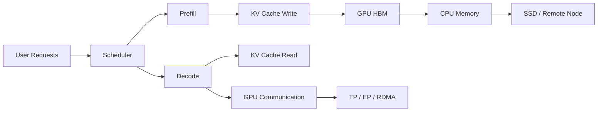
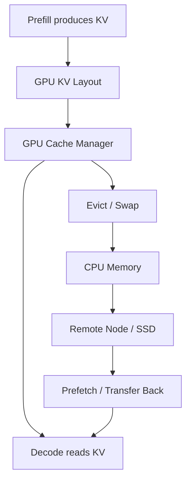

# LLM Serving Systems 课程概览

## 1. 这门课要解决什么问题

这门课服务于一个具体能力目标：

> 能读懂、分析并优化多 GPU 大模型推理系统中的通信、缓存、IO、调度与 KV Cache 后端。

典型问题包括：

- KV Cache 怎么布局？
- 怎么减少显存碎片？
- 怎么更快读写 KV？
- GPU、CPU、SSD、节点之间怎么搬 KV？
- 怎么支持更大的 batch 和更长上下文？
- prefill、decode、通信、IO 怎么 overlap？
- MoRI-IO 这类后端到底在系统里优化什么？

这不是纯模型算法问题，而是 **GPU 并行计算 + 数据库缓存系统 + 分布式通信 + LLM 推理框架** 的交叉。

## 2. 核心直觉

LLM 推理不是“模型算完就结束”。在大规模 serving 中，请求会不断进入系统，每个请求都会产生、读取、迁移和复用 KV Cache。真正的瓶颈经常不是 FLOPs，而是数据流：

优化目标可以压缩成一句话：

> 让 token、KV Cache、请求队列、GPU 显存、GPU 间通信、CPU/SSD/NIC 数据搬运一起流动得更顺。

## 3. 必须掌握的五层知识

| 层级 | 学什么 | 对应能力 |
|---|---|---|
| Transformer 推理 | prefill/decode、attention、KV Cache、GQA/MQA/MLA、MoE | 看懂每个 token 和每份 KV 从哪里来、到哪里去 |
| GPU 系统 | memory hierarchy、roofline、CUDA/HIP、kernel、profiling | 判断瓶颈是算力、显存带宽、访存布局还是 kernel 调度 |
| OS/Database 缓存与 IO | buffer pool、page/block、eviction、prefetch、fragmentation | 把 KV Cache 当成高并发分层缓存系统来管理 |
| 分布式通信 | TP、PP、EP、RDMA、NCCL/RCCL、all-reduce、all-to-all | 分析多 GPU/多节点推理中的通信代价 |
| LLM Serving 框架 | vLLM、SGLang、LMCache、Mooncake、HiCache、MoRI | 把基础知识落到真实框架和论文实现 |

## 4. 最重要的 KV Cache 公式

KV Cache 大小通常可以先用下面的近似式估算：

$$
\text{KV bytes}
=
2 \times L \times B \times S \times H_{kv} \times D_{head} \times \text{bytes\_per\_elem}
$$

其中：

- $2$：表示 K 和 V 两份缓存。
- $L$：Transformer 层数。
- $B$：batch size 或并发请求数。
- $S$：上下文长度，也就是 cache length。
- $H_{kv}$：KV head 数。GQA/MQA 会减少这个维度。
- $D_{head}$：每个 head 的维度。
- $\text{bytes\_per\_elem}$：每个元素占多少字节，例如 FP16/BF16 是 2 字节，FP8 是 1 字节，FP4 是 0.5 字节。

以后看任何 KV 优化，都先问：

1. 它减少的是 $S$、$H_{kv}$、bitwidth，还是重复缓存？
2. 它减少的是显存占用、HBM 读写、GPU 间通信，还是 CPU/SSD IO？
3. 它引入了多少额外的 decode latency？
4. 它对精度、cache hit rate、吞吐和 TTFT/TPOT 的影响分别是什么？

## 5. MoRI-IO KV Cache 后端的定位

MoRI-IO 可以理解为一种面向大规模推理的数据移动与缓存后端。它关心的不是单个 attention 算子本身，而是 KV Cache 在系统里的生命周期：

它对应的问题包括：

- KV Cache 的物理布局和逻辑索引如何分离？
- KV block/page 多大合适？
- 显存不够时，哪些 KV 留在 HBM，哪些换到 CPU 或远端？
- 请求调度如何感知 KV Cache 所在位置？
- decode 前能不能提前 prefetch？
- 多 GPU/多节点之间搬 KV 时，网络优先级怎么管理？
- 通信能否和计算 overlap？

## 6. 学完后的检查标准

学完这门课，至少要能完成四类任务：

1. 给定模型配置，估算 KV Cache 占用和 decode 阶段带宽压力。
2. 读懂 vLLM/SGLang 中 KV block、prefix cache、scheduler 的基本实现。
3. 解释一个多 GPU 推理配置中 TP/EP/PD disaggregation 产生的通信。
4. 针对一个 serving trace 写优化报告：瓶颈在哪里、该改 layout、cache、IO、scheduler 还是通信。

## 7. 课程文件结构

- [[../01 Study Plan/LLM Serving Systems 12周学习路线|LLM Serving Systems 12周学习路线]]
- [[../02 Reading Map/LLM Serving Systems 论文与系统阅读地图|LLM Serving Systems 论文与系统阅读地图]]
- [[../03 Concept Map/多 GPU 推理与 KV Cache 后端术语地图|多 GPU 推理与 KV Cache 后端术语地图]]
- [[../99 Resources/LLM Serving Systems 资源索引|LLM Serving Systems 资源索引]]
