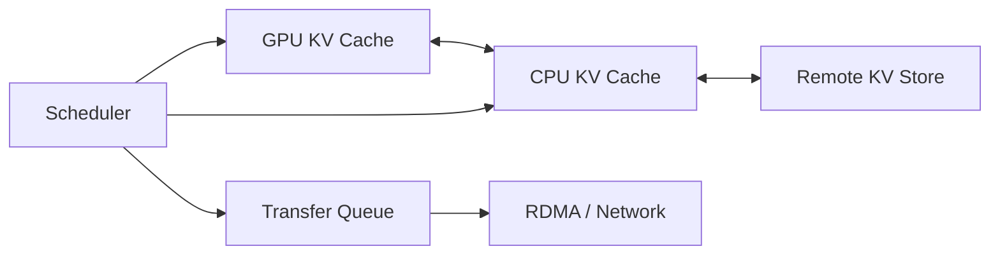

# LLM Serving Systems 12周学习路线

## 0. 学习目标

这条路线的目标不是泛泛学习大模型，而是掌握下面这类优化问题：

- 多 GPU 推理中的通信、缓存、IO、调度。
- MoRI-IO / HiCache / LMCache 这类 KV Cache 后端。
- DeepSeek-R1 这类大规模推理中的 TCO、吞吐、延迟和显存权衡。

最终要形成的能力是：

> 把 KV Cache 看成一个高并发、低延迟、分层存储系统，而不是只把它看成 attention 的中间张量。

## 1. 总路线

| 阶段 | 周数 | 主线 | 产出 |
|---|---:|---|---|
| A | 1-2 | Transformer 推理形状与 KV Cache | KV 生命周期笔记 |
| B | 3-4 | GPU memory、kernel 与 profiling | 一个 attention benchmark 分析 |
| C | 5-6 | KV Cache 管理与 serving scheduler | vLLM vs SGLang 对照图 |
| D | 7-8 | 分层缓存、IO 与 offloading | 简化版 MoRI-IO 设计草图 |
| E | 9-10 | 多 GPU 通信与 MoE serving | DeepSeek-R1 通信路径分析 |
| F | 11-12 | 调度、overlap 与端到端优化 | serving 优化报告模板 |

## 2. Week 1-2: Transformer 推理形状

### 要学什么

- prefill 和 decode 的区别。
- attention 中 $Q$、$K$、$V$ 的形状。
- KV Cache 为什么能避免重复计算。
- MHA、MQA、GQA、MLA 的 KV head 差异。
- MoE 模型中 expert dispatch/combine 为什么会引入通信。

### 必须掌握的公式

KV Cache 大小：

$$
\text{KV bytes}
=
2 \times L \times B \times S \times H_{kv} \times D_{head} \times \text{bytes\_per\_elem}
$$

decode 阶段每生成一个 token，通常需要读历史长度 $S$ 对应的 KV，因此当 $S$ 很大时，decode 很容易变成 memory-bandwidth-bound。

### 推荐学习材料

- Transformer 原论文中 attention 部分。
- The Illustrated Transformer。
- vLLM PagedAttention 论文的背景部分。
- DeepSeek-V2/V3/R1 技术报告中 MLA、MoE 相关部分。

### 本阶段产出

写一页笔记：

> 一个请求从 prefill 到 decode 的 KV Cache 生命周期。

至少回答：

1. prompt token 如何产生 KV？
2. decode token 如何读取历史 KV？
3. 不同层、不同 head 的 KV 如何组织？
4. 上下文变长时，显存和带宽怎样增长？

## 3. Week 3-4: GPU 系统与 profiling

### 要学什么

- GPU memory hierarchy：HBM、L2、shared memory、register。
- coalesced memory access。
- roofline model：compute-bound vs memory-bound。
- CUDA/HIP kernel 基础。
- stream、async copy、kernel launch overhead。
- Nsight / rocprof / PyTorch profiler 的基本使用。

### 推荐课程

- Stanford CS149 Parallel Computing。
- CMU 15-418/15-618 Parallel Computer Architecture and Programming。

### 本阶段产出

做一个小 benchmark：

1. 跑一次 attention 或矩阵乘法。
2. 记录 kernel time、memory bandwidth、GPU utilization。
3. 判断瓶颈是计算还是访存。

用一句话写出判断逻辑：

> 如果实际算力远低于峰值算力，但显存带宽接近上限，通常说明是 memory-bound。

## 4. Week 5-6: KV Cache 管理与 serving scheduler

### 要学什么

- vLLM PagedAttention。
- block table / page table。
- continuous batching。
- SGLang RadixAttention。
- prefix cache / prompt cache。
- cache-aware load balancing。
- quantized KV cache。

### 关键问题

| 问题 | 要看的机制 |
|---|---|
| 怎么减少显存碎片？ | paged KV block |
| 多请求长度不同怎么办？ | continuous batching |
| 相同 prefix 怎么复用？ | RadixAttention / prefix tree |
| KV 低精度后怎么读写？ | FP8/FP4 KV cache + fused attention |
| scheduler 怎么知道 cache 在哪里？ | cache-aware routing |

### 本阶段产出

画一张对照图：

> vLLM PagedAttention vs SGLang RadixAttention。

建议比较：

- 核心数据结构。
- 解决的主要问题。
- 对长上下文的帮助。
- 对多轮对话/共享 prefix 的帮助。
- 可能带来的调度复杂度。

## 5. Week 7-8: 分层缓存、IO 与 offloading

### 要学什么

- OS buffer cache。
- Database buffer pool。
- page replacement / eviction。
- prefetch。
- CPU pinned memory。
- GPU Direct RDMA。
- KV offloading。
- GPU/CPU/SSD/远端节点的分层缓存。

### 推荐课程

- CMU 15-445 Database Systems，重点看 storage、buffer pool、concurrency、query execution。
- 操作系统课程中的 virtual memory、page replacement、IO scheduling。

### 类比关系

| Database / OS | LLM KV Cache |
|---|---|
| buffer pool | GPU/CPU/SSD 分层 KV cache |
| page | KV block / KV page |
| page table | block table |
| eviction | KV swap / offload |
| prefetch | decode 前提前搬 KV |
| fragmentation | 显存碎片和 block waste |
| IO scheduler | KV transfer scheduler |

### 本阶段产出

设计一个简化版 MoRI-IO：

至少定义：

1. KV block 的元数据。
2. GPU cache 满了如何淘汰。
3. decode 前如何 prefetch。
4. 远端 KV transfer 如何排队。
5. scheduler 如何感知 KV 位置。

## 6. Week 9-10: 多 GPU 通信与 MoE serving

### 要学什么

- tensor parallelism。
- pipeline parallelism。
- expert parallelism。
- all-reduce、all-gather、reduce-scatter、all-to-all。
- NCCL / RCCL。
- PCIe、NVLink、XGMI、InfiniBand、Ethernet。
- RDMA。
- MoE dispatch/combine。
- communication-computation overlap。

### 推荐阅读

- Megatron-LM 中 tensor parallelism。
- DeepSpeed MoE / Tutel / MegaBlocks。
- DeepEP。
- AMD MoRI / MoRI-EP / MoRI-IO 相关技术文章。

### 本阶段产出

写一页分析：

> DeepSeek-R1 请求在 TP=8、EP 多节点下可能产生哪些通信？

至少拆成：

- attention/MLP 中的 tensor parallel 通信。
- MoE expert dispatch/combine。
- KV transfer。
- prefill/decode 拆分后的跨节点数据移动。

## 7. Week 11-12: 调度、overlap 与端到端优化

### 要学什么

- prefill/decode disaggregation。
- two-batch overlap。
- continuous batching。
- speculative decoding。
- multi-token prediction。
- admission control。
- latency/throughput tradeoff。
- TCO 分析。

### 指标

| 指标 | 含义 |
|---|---|
| TTFT | Time To First Token，首 token 延迟 |
| TPOT | Time Per Output Token，平均每个输出 token 延迟 |
| throughput | 单位时间输出 token 数 |
| cache hit rate | prefix/KV cache 命中率 |
| GPU utilization | GPU 利用率 |
| memory bandwidth utilization | 显存带宽利用率 |
| TCO | 总拥有成本 |

### 本阶段产出

写一份 serving 优化报告模板：

1. 当前配置：模型、GPU、TP/PP/EP、batch、上下文长度。
2. 当前指标：TTFT、TPOT、throughput、显存、cache hit rate。
3. trace 观察：计算、通信、IO、scheduler 哪个在等。
4. 判断瓶颈：compute-bound、memory-bound、network-bound、scheduler-bound。
5. 优化方案：layout、cache、quantization、offload、overlap、spec decoding。
6. 风险：精度、复杂度、tail latency、稳定性。

## 8. 最短路径

如果最近只想快速进入 MoRI-IO / KV Cache 后端优化，按这个顺序：

1. vLLM PagedAttention。
2. SGLang RadixAttention / HiCache / PD Disaggregation。
3. CMU 15-445 Buffer Pool。
4. Stanford CS149 GPU memory / locality / CUDA。
5. LMCache / Mooncake / Strata。
6. AMD MoRI / MoRI-IO。
7. KV quantization：KIVI、KVQuant、GEAR。
8. MoE communication：DeepEP / MoRI-EP。

## 9. 每篇论文的阅读模板

读 serving 系统论文时，用这几个问题定位：

1. 它优化的是 prefill、decode、KV cache、通信、scheduler 还是 IO？
2. 它的核心数据结构是什么？
3. 它减少了什么资源：显存、带宽、网络、等待时间、重复计算？
4. 它引入了什么额外代价：精度损失、metadata、调度复杂度、tail latency？
5. 它的实验指标是 TTFT、TPOT、throughput、显存还是 TCO？
6. 它能不能和 PagedAttention、RadixAttention、PD disaggregation、KV quantization 组合？
