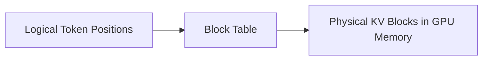

# LLM Serving Systems 论文与系统阅读地图

## 1. 阅读顺序总览

不要按热度乱读。建议按“单机 KV 管理 -> prefix 复用 -> prefill/decode 拆分 -> 分层缓存/IO -> KV 量化 -> 多 GPU/MoE 通信 -> speculative decoding”的顺序。

| 顺序 | 主题 | 代表系统/论文 | 读完要懂什么 |
|---:|---|---|---|
| 1 | KV Cache paging | vLLM / PagedAttention | 为什么 KV cache 需要 page/block 管理 |
| 2 | Prefix cache | SGLang / RadixAttention | 相同 prefix 如何复用 KV |
| 3 | Prefill-decode disaggregation | DistServe / Splitwise / SGLang PD | prefill 和 decode 为什么应拆开调度 |
| 4 | 分层 KV cache | LMCache / Mooncake / HiCache / Strata | GPU/CPU/SSD/远端 KV 如何分层 |
| 5 | KV Cache quantization | KIVI / KVQuant / GEAR / ZipCache / MiniCache | 如何用低 bit 压缩 KV |
| 6 | MoE serving communication | MegaBlocks / Tutel / DeepEP / MoRI-EP | expert dispatch/combine 为什么是通信瓶颈 |
| 7 | 推测解码 | Speculative decoding / Medusa / MTP | 如何缓解 decode 串行瓶颈 |

## 2. 第一组：PagedAttention 与 vLLM

### 为什么先读

PagedAttention 是 KV Cache 管理的入门核心。它把 KV Cache 从“连续大张量”变成“分页管理的块”，解决了长短请求混合时的显存碎片问题。

### 重点问题

- 为什么传统 contiguous KV allocation 会浪费显存？
- KV block/page 是什么？
- block table 如何从逻辑 token 位置映射到物理 KV block？
- continuous batching 如何和 PagedAttention 配合？
- block size 变大会怎样，变小会怎样？

### 读完产出

画出：



## 3. 第二组：SGLang 与 RadixAttention

### 为什么读

SGLang 的核心问题不是只管理“单个请求的 KV”，而是复用多个请求之间共享的 prefix。多轮对话、RAG、agent workflow 都会反复出现相同前缀。

### 重点问题

- Radix tree 如何表示共享 prefix？
- prefix cache hit 如何减少 prefill？
- prefix cache 对 TTFT 和 throughput 的影响是什么？
- cache-aware load balancer 为什么重要？
- prefix cache 和 PagedAttention 能否组合？

### 读完产出

做一张对照表：

| 机制 | 解决的问题 | 核心数据结构 | 主要收益 |
|---|---|---|---|
| PagedAttention | 显存碎片和动态 batch | block table | 提高显存利用率 |
| RadixAttention | prefix 重复计算 | radix tree | 提高 cache hit rate |

## 4. 第三组：Prefill-Decode Disaggregation

### 为什么读

prefill 和 decode 的资源特征不同：

- prefill：大矩阵计算多，偏 compute-intensive。
- decode：每步只生成一个 token，需要反复读历史 KV，偏 memory-intensive。

把它们混在同一批次里调度，容易互相拖累。

### 重点问题

- prefill 和 decode 为什么会互相干扰？
- 拆分后 KV Cache 如何从 prefill worker 传到 decode worker？
- 拆分会改善 TTFT、TPOT 还是 throughput？
- KV transfer 本身会不会变成新瓶颈？
- two-batch overlap 如何隐藏通信或 IO？

### 代表方向

- DistServe。
- Splitwise。
- SGLang PD disaggregation。
- Mooncake。

## 5. 第四组：分层 KV Cache 与 IO

### 为什么读

MoRI-IO、HiCache、LMCache、Mooncake、Strata 这一类工作，本质是在问：

> 当 HBM 放不下所有 KV 时，系统如何把 KV 放到 CPU、SSD 或远端节点，同时不让 decode 等太久？

### 重点问题

- KV block 的 metadata 如何维护？
- GPU cache、CPU cache、SSD cache 的层级如何设计？
- eviction policy 如何选？
- prefetch 如何预测未来会读哪些 KV？
- RDMA transfer 如何排队？
- cache hit rate 和 tail latency 如何权衡？
- CPU/GPU layout 是否应该解耦？

### 推荐阅读主题

| 主题 | 重点 |
|---|---|
| LMCache | KV cache reuse/offload |
| Mooncake | serving 中的 KV-centric disaggregation |
| HiCache | SGLang 分层 KV cache |
| Strata | GPU-assisted IO、layout decoupling、fragmentation、cache-aware scheduling |
| MoRI-IO | RDMA-oriented KV transfer 与网络优先级管理 |

## 6. 第五组：KV Cache Quantization

### 为什么读

KV Cache 量化直接减少：

$$
\text{bytes\_per\_elem}
$$

因此它会降低显存占用、HBM 读写量和跨设备传输量。但低 bit 会带来精度损失和额外 dequant 开销。

### 重点问题

- K 和 V 的数值分布是否不同？
- per-token、per-channel、per-head 量化有什么差异？
- outlier 怎么处理？
- residual cache 为什么有用？
- dequant 能否和 attention kernel fusion？
- FP8、FP4、INT4、INT2 的系统代价分别是什么？

### 代表方向

- KIVI。
- KVQuant。
- GEAR。
- ZipCache。
- MiniCache。
- SGLang quantized KV cache。

## 7. 第六组：MoE Serving 与多 GPU 通信

### 为什么读

DeepSeek-R1 这类 MoE 模型的瓶颈往往不只是 attention，而是 expert parallelism 带来的 all-to-all 通信。

### 重点问题

- token 如何被 router 分配到 expert？
- expert dispatch/combine 产生什么通信？
- expert load imbalance 如何影响 latency？
- tensor parallelism 与 expert parallelism 如何叠加？
- MoRI-EP / DeepEP 如何优化 MoE 通信？
- MoRI-IO 和 MoRI-EP 如何共享底层 RDMA primitives？

### 代表方向

- MegaBlocks。
- Tutel。
- DeepSpeed MoE。
- DeepEP。
- MoRI-EP。

## 8. 第七组：Speculative Decoding 与 MTP

### 为什么读

decode 是逐 token 串行过程。即使每一步很快，长输出时也会积累大量延迟。推测解码和 MTP 试图一次推进多个 token。

### 重点问题

- draft model 如何生成候选 token？
- target model 如何 verify？
- 接受率如何影响加速比？
- MTP 和 speculative decoding 的关系是什么？
- 多 token 推进会怎样改变 scheduler 和 KV Cache 写入？

### 代表方向

- Speculative decoding。
- Medusa。
- EAGLE。
- MTP。
- ROCm Specv2 MTP。

## 9. 阅读时统一记录的字段

每篇论文或系统笔记都建议记录：

```markdown
## 论文/系统定位
- 优化对象：
- 所在阶段：prefill / decode / cache / IO / communication / scheduler
- 核心数据结构：
- 核心系统技巧：

## 资源收益
- 减少显存：
- 减少 HBM 读写：
- 减少网络通信：
- 减少等待时间：
- 提高 cache hit rate：

## 代价与风险
- 精度损失：
- 额外 metadata：
- 额外 kernel：
- 调度复杂度：
- tail latency 风险：

## 和已有系统的关系
- 与 PagedAttention：
- 与 RadixAttention：
- 与 PD disaggregation：
- 与 KV quantization：
- 与 MoE communication：
```
